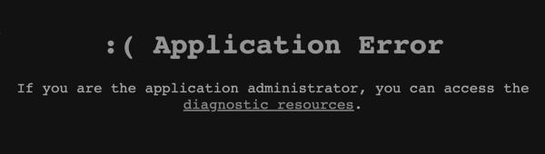
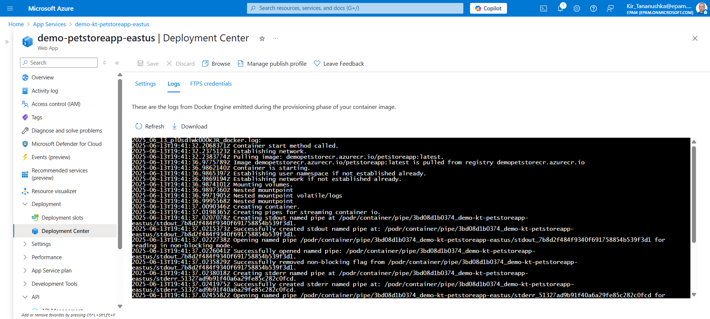

# Fixing Application Error

> ⚠️ **Disclaimer**: Azure evolves faster than your coffee gets cold ☕ — so if the logs look different, UI buttons moved, or something works "differently today", it’s not broken — it’s just Azure being Azure. You're engineers, not screenshot-following robots. So when the portal says "Application Error", don’t panic — check the docs, search like a ninja, or ask ChatGPT (it’s cheaper than support 😉).

<hr>

## The problem

After deploying a Web App using a Docker container from Azure Container Registry (ACR), the application shows a black screen with the message:

  

This usually means the container was pulled successfully, but failed to start correctly on Azure App Service.

---

## Root causes

1. Missing environment variable `WEBSITES_PORT=8080`.
2. The container image is not available in ACR or not tagged correctly.
3. App Service failed to pull the container image due to outdated credentials.
4. The container starts, but crashes at runtime (e.g., port issue, Spring Boot error).
5. (If using Apple) The image was built for `linux/arm64`, but App Service supports only `linux/amd64`.

---

## How to check container startup logs (Deployment Center)

1. Go to your **App Service** in the Azure Portal.
2. In the left-hand menu, click **Deployment Center**.
3. Switch to the **Logs** tab.
4. Here you’ll find detailed logs from the Docker Engine — including pull status, startup execution, and error codes.

These logs are especially helpful if:

* The container exited immediately after startup
* There's a port or entrypoint mismatch
* The app crashed due to environment or runtime config issues

Example:



---

## Solution steps

### Step 1: Set `WEBSITES_PORT` (Required) and `EXPOSE` (Recommended)

Azure needs to know which internal port your container listens on. It **does not detect** this automatically from your Dockerfile — even if it contains an `EXPOSE` instruction.

#### 1.1: Set `WEBSITES_PORT=8080` in App Service (Required)

1. Go to your **App Service** in the Azure portal.
2. Navigate to **Configuration** → **Application settings**.
3. Add the following setting:
   ```bash
   Name: WEBSITES_PORT
   Value: 8080
   ```
4. Click **Save**.
5. Restart the App Service from the **Overview** tab.

> Without this setting, Azure won't be able to route HTTP traffic to your container, and your app will show an “Application Error” screen.

---

#### 1.2: Add `EXPOSE 8080` to your Dockerfile (Optional but Recommended)

While Azure does not use the `EXPOSE` instruction to detect the port, it’s still good practice to include it:

```Dockerfile
EXPOSE 8080
```

Benefits of adding `EXPOSE`:
- Improves clarity and documentation of your image
- Helps when using `docker run -P` or multi-platform builds
- Required by some tools (e.g., Docker Compose or ACR Tasks) to infer container behavior

> So: always **set `WEBSITES_PORT=8080`** in App Service, and **optionally add `EXPOSE 8080`** in your Dockerfile to follow best practices.

---

### Step 2: Verify the Docker image in ACR

1. Open your **Azure Container Registry** in the portal.
2. Go to **Repositories**.
3. Make sure your image (e.g. `petstoreapp`) appears in the list.
4. Confirm the correct tag is used (e.g. `latest`).

If the image is missing or mistagged, push it again:

```bash
docker build -t <acr-name>.azurecr.io/petstoreapp:latest .
docker push <acr-name>.azurecr.io/petstoreapp:latest
```

---

### Step 3: Refresh the image in Deployment Center

Sometimes App Service doesn’t refresh credentials after an image change.

1. Open your **App Service**.
2. Go to **Deployment Center**.
3. Re-select the container image and tag.
4. Click **Save** and **Restart** the app.

---

### Step 4: Check container logs

1. Go to your App Service → **Log Stream**.
2. Wait for the app to restart and watch the logs in real time.
3. Look for error messages such as:
    - Image pull failed
    - Port not found or exposed
    - Spring Boot startup errors

This will help identify what went wrong inside the container.

---

### Step 5: Test the image locally

If you're unsure whether your image works at all, test it locally:

```bash
docker pull <acr-name>.azurecr.io/petstoreapp:latest
docker run -p 8080:8080 <acr-name>.azurecr.io/petstoreapp:latest
```

Then open `http://localhost:8080` in your browser.  
If the container fails locally too, the issue is inside your application or Dockerfile.

---

### Step 6: (Apple M1/M2 users only) Build for AMD64, not ARM64

Azure App Service currently does **not support ARM64 images**. If you’re using a Mac with an M1 or M2 chip, Docker will build images for `linux/arm64` by default — and those won’t work in App Service.

To fix this:

Build your image explicitly for `linux/amd64` using Docker Buildx:

```bash
docker buildx build --platform linux/amd64 -t <acr-name>.azurecr.io/petstoreapp:latest --push .
```

Alternatively, if you're using classic `docker build`, add:

```bash
docker build --platform linux/amd64 -t <acr-name>.azurecr.io/petstoreapp:latest .
```

> This forces Docker to build an image compatible with Azure App Service.

If you want to support both platforms (for local testing and deployment), you can build a multi-architecture image:

```bash
docker buildx build --platform linux/amd64,linux/arm64 -t <acr-name>.azurecr.io/petstoreapp:latest --push .
```

> For a complete guide on building cross-platform images (including multi-arch builds and Dockerfile examples), check out: [Working with ARM64 on Mac for Azure App Service](./working-with-arm64-on-mac.md)
