# Step-by-Step Guide for Module 10 (Authentication)

> ⚠️ **Disclaimer**: Azure Portal updates more frequently than your dependencies, so expect UI changes, button
> relocations, and occasional menu reshuffling. This guide captures the current state, but cloud platforms evolve
> constantly. When screenshots don't match reality, trust your developer instincts over pixel-perfect instructions.
> Documentation, search engines, and AI assistants remain your reliable companions when the portal decides to surprise
> you.

<hr>

## Microsoft Entra External ID Setup Guide

This guide walks you through setting up Microsoft Entra External ID for customer authentication in your Pet Store
application. You'll create a dedicated tenant for external users, register your Spring Boot application, configure user
flows for sign-up/sign-in, and gather the credentials needed for your application configuration. By the end, you'll have
a complete OAuth2/OpenID Connect authentication system that separates customer identities from your organization's
internal users.

## 1. Initial Setup and Tenant Creation

### Step 1: Navigate to Microsoft Entra ID

The first step is to access the Microsoft Entra ID service in the Azure Portal. This service, formerly known as Azure
Active Directory, is where you'll manage your application registrations and user identities.

1. In the main search bar at the top of the Azure Portal, type **"Microsoft Entra ID"**.
2. From the search results, click on the service named **"Microsoft Entra ID"**. This will take you to the main overview
   page for the service.

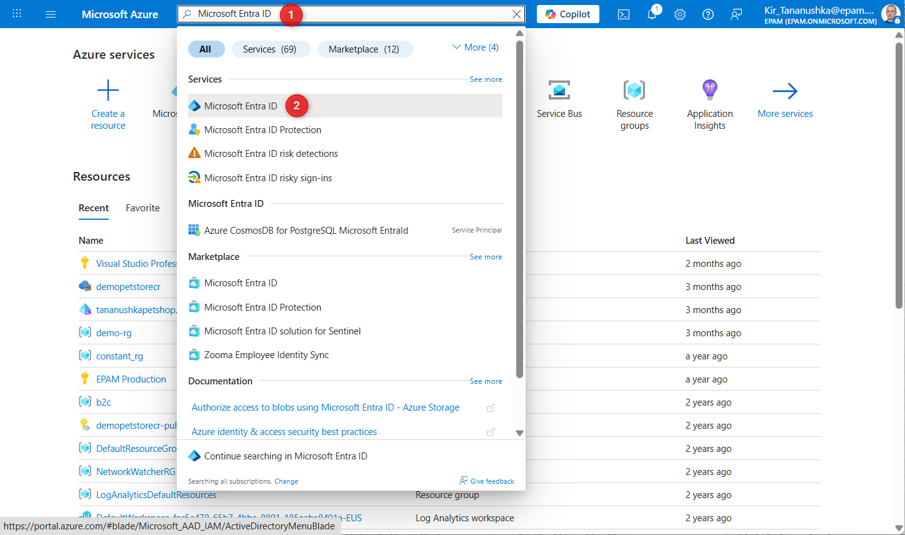

---

### Step 2: Manage Your Tenants

Before you can create a new application for external users, you need to be in the correct tenant. Since you're building
a customer identity application, you need to create or switch to a separate tenant that's dedicated to your customers.

1. From the **Microsoft Entra ID Overview** page, find the **"Manage tenants"** button at the top of the screen.
2. Click **"Manage tenants"** to view and switch between your different Microsoft Entra ID tenants.

This is a crucial step to ensure that your customer identities are kept separate from your employee identities.

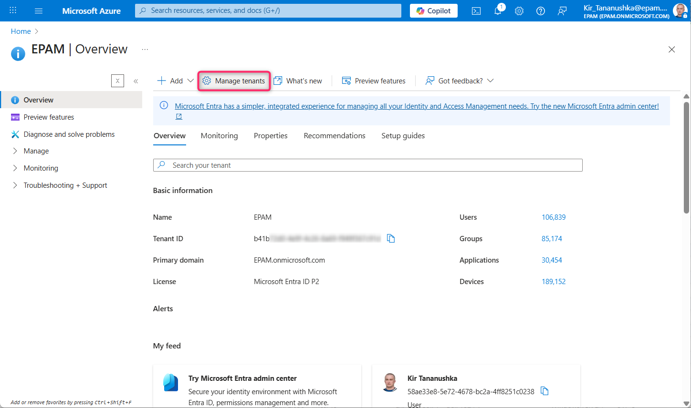

---

### Step 3: Create a New Tenant

From the **Manage tenants** view, you can see all your existing tenants. Since you need a dedicated environment for
customer identities, you'll create a new one.

1. Click the **"Create"** button in the top-left corner of the page.

This will start the process of creating a new Microsoft Entra tenant, which will serve as the home for all your external
users.

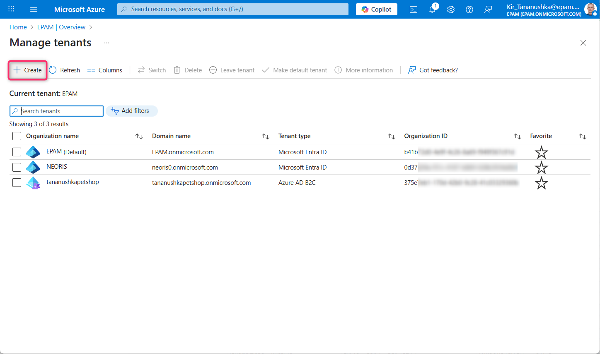

---

### Step 4: Select the Tenant Type

On the **Create a tenant** page, you'll be asked to choose the type of tenant you want to create.

1. Select **"Microsoft Entra External ID"**. This is the modern, recommended service for managing customer identities
   for your applications.
2. Click **"Next : Configuration >"** to proceed.

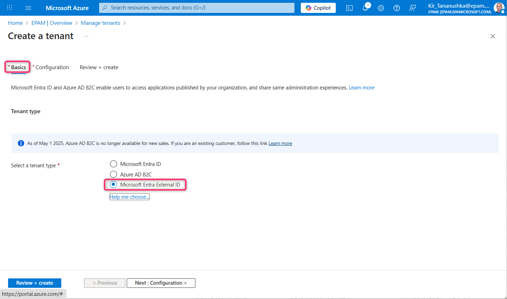

---

### Step 5: Configure Your New Tenant

Now it's time to set up the basic details for your new external tenant.

1. **Organization name:** Enter a name for your tenant. This is just a display name that's easy to recognize, like
   `Petshop Demo`.
2. **Initial domain name:** This will be your tenant's unique domain. It's automatically generated based on the
   organization name you enter, followed by `.onmicrosoft.com`. Make sure it's unique.
3. **Country/Region:** You need to select a country where your data will be stored.
4. **Subscription:** Choose the Azure subscription you want to link to this tenant. In our case, this is a Visual Studio
   Professional Subscription.
5. **Resource group:** Select or create a resource group to hold the tenant's resources. It is preferable to use a
   resource group that contains resources you do not need to delete immediately after use.

Once you've filled out these details, click **"Next : Review + create >"** to continue.

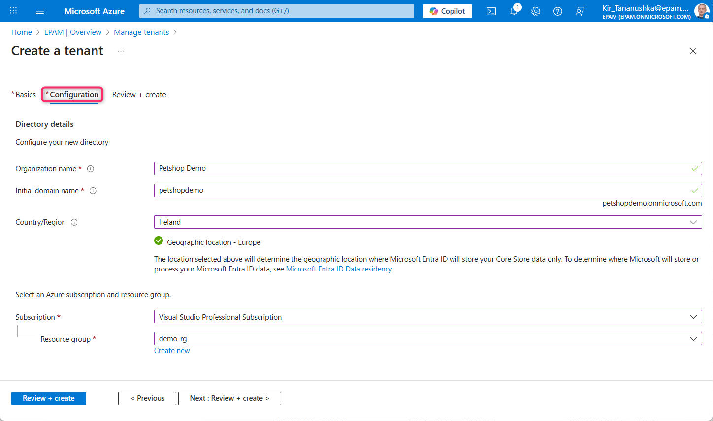

---

### Step 6: Review and Create Your Tenant

On the **Review + create** page, you'll see a summary of all the information you entered in the previous steps.

1. Review the details to make sure everything is correct.
2. Once you've verified the information and see "Validation passed," click the **"Create"** button at the bottom of the
   page.

This will start the process of provisioning your new Microsoft Entra External ID tenant. The creation process can take
up to 30 minutes to complete.

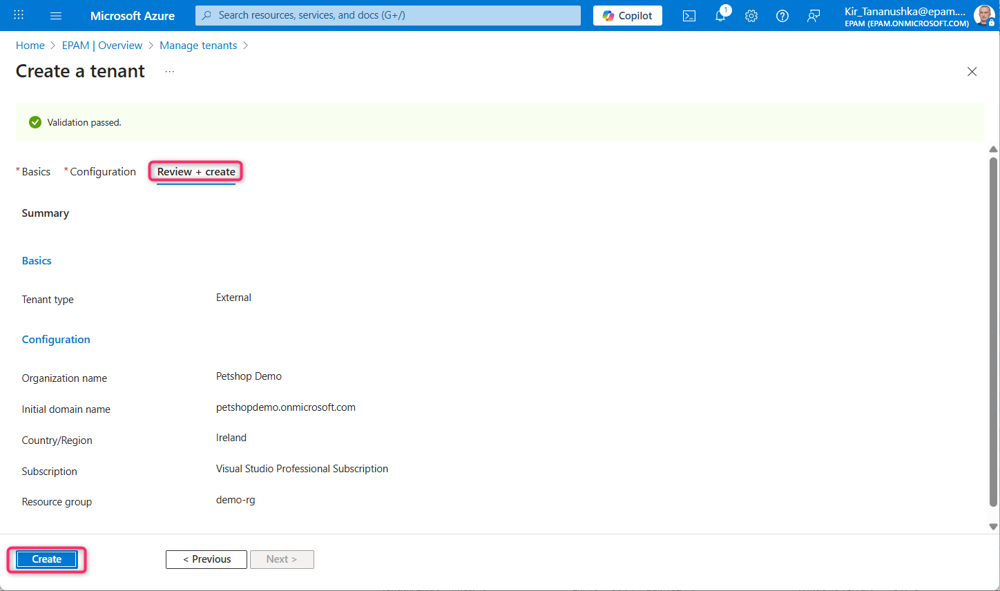

---

### Step 7: Navigate to the New Tenant

The new tenant has been successfully created. Now you have a dedicated environment to manage your customer identities.
The message on the screen indicates "Tenant creation was successful" and provides a link to navigate to your new tenant.

1. Click on the link that says **"Click here to navigate to your new tenant"**.

This will take you to the administration page for your new, separate tenant. All subsequent steps, like registering your
application and creating user flows, must be done within this tenant.

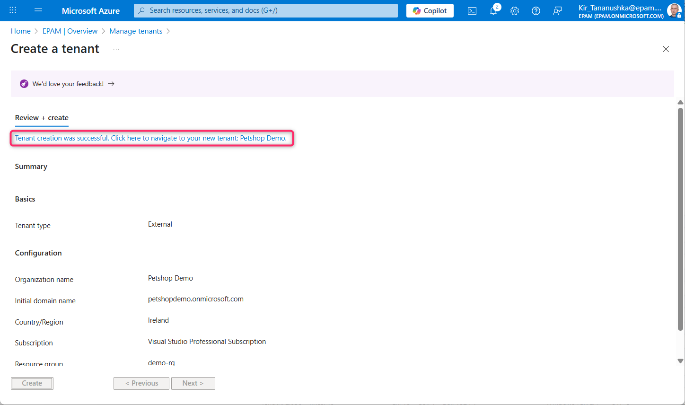

---

### Step 8: Multi-Factor Authentication Setup

Azure may require you to set up multi-factor authentication (MFA) for your new administrator account to enhance its
security.

1. On the **"Keep your account secure"** page, click **"Next"**.

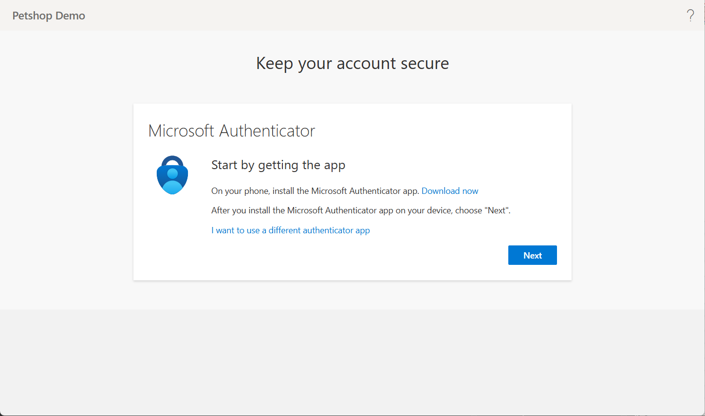

---

### Step 9: Configure the Authenticator App

Now, you'll connect the Microsoft Authenticator app on your phone to your administrator account.

1. Open the **Microsoft Authenticator** app on your phone.
2. If prompted, grant notification permissions.
3. Tap the `+` sign to add a new account, then select **"Work or school account"**.
4. After following these steps on your phone, click **"Next"** on the Azure Portal page.

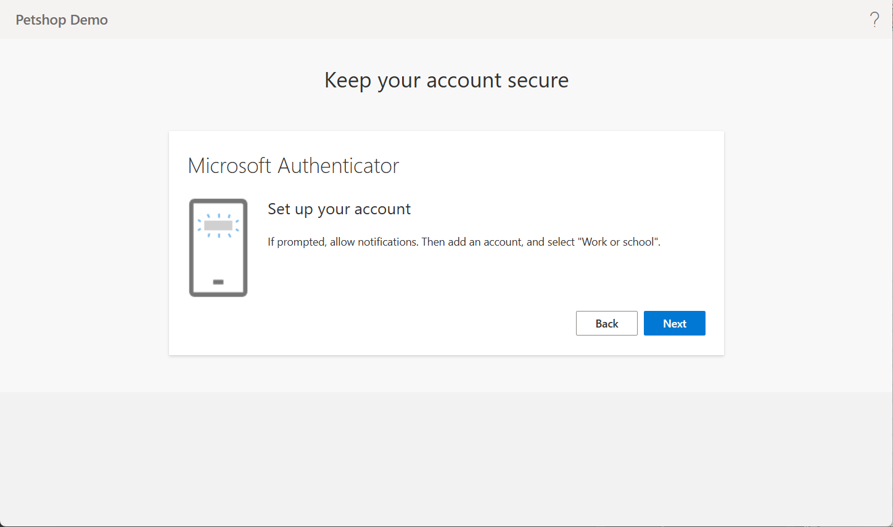

---

### Step 10: Scan the QR Code

A QR code will appear on your screen. You will use this to link your account to the app.

1. Use the Microsoft Authenticator app on your phone to scan the QR code displayed on the screen. The app will
   automatically detect your new account.
2. Once the account is successfully added, click **"Next"** on the Azure Portal page.

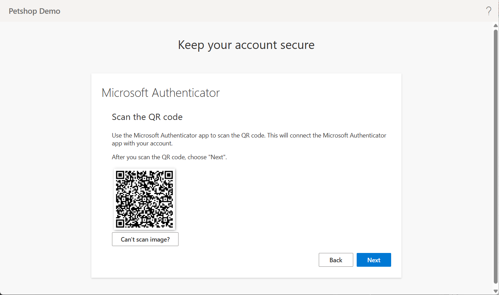

---

### Step 11: Verify Your Authenticator App

Azure will send a test notification to your phone to confirm the connection is working.

1. A notification will be sent to your Microsoft Authenticator app.
2. Open the app and enter the number shown on the Azure Portal page into the authenticator app to approve the sign-in.
3. Once approved, click **"Next"** on the Azure Portal page.

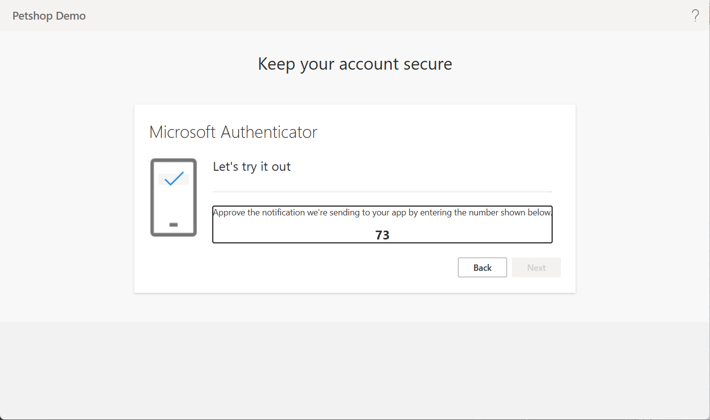

---

### Step 12: Finish MFA Setup

You have now successfully set up your security information.

1. The screen will show a confirmation message: **"Success! You have successfully set up your security info."**
2. Click the **"Done"** button to proceed.

You should now be logged into your new tenant and ready to continue configuring your application.

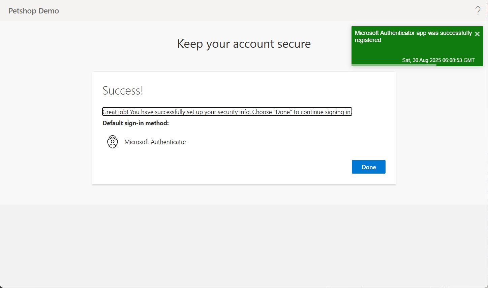

---

## 2. Application Registration

### Step 13: Go to App Registrations

You have successfully navigated to the new tenant. Now, you can begin the process of registering your application.

1. In the left-hand navigation menu, under the **"Manage"** section, click on **"App registrations"**.

This is where you will create a new entry for your Spring Boot application so it can securely communicate with your
Microsoft Entra External ID tenant.

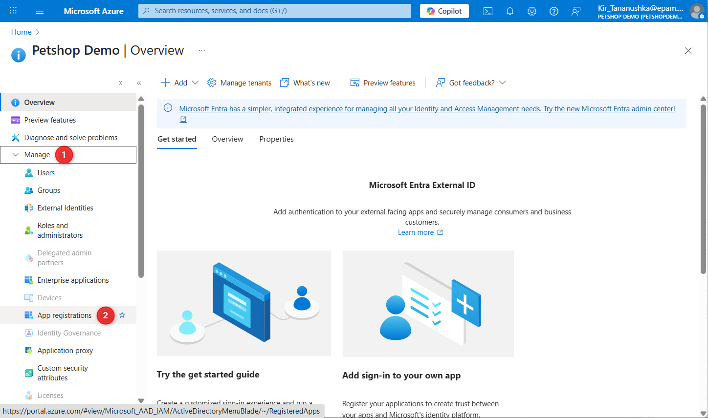

---

### Step 14: Register a New Application

1. Click on the **"+ New registration"** button located at the top of the **App registrations** page.

This will open the registration wizard, where you will provide the details about your Spring Boot application.

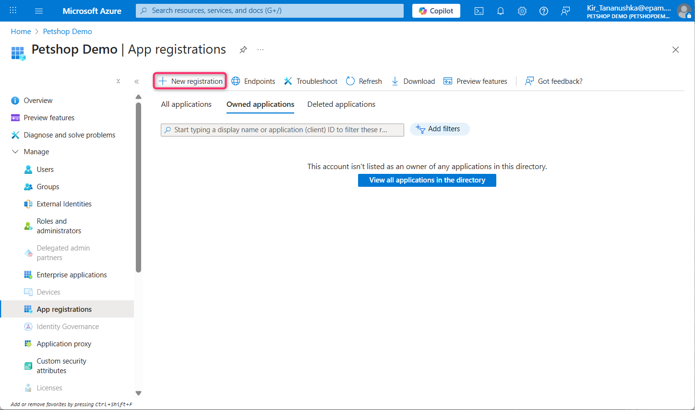

---

### Step 15: Configure Your Application Registration

Now you need to configure the basic settings for your application, including its name, supported account types, and the
redirect URI.

1. **Name:** Give your application a descriptive name for display purposes.
2. **Supported account types:** This choice determines which users can get access to your application. Select the
   option: **Accounts in any organizational directory (Any Microsoft Entra ID tenant - Multitenant) and personal
   Microsoft accounts (e.g. Skype, Xbox)**.
    * **Why this choice?** This option provides maximum flexibility, allowing your application to accept accounts from
      any other Microsoft Entra ID tenants (e.g., from partners or other organizations) as well as personal Microsoft
      accounts.
3. **Redirect URI:** This is the address where Microsoft Entra ID will send the user back after successful
   authentication.
    * From the dropdown menu, select **Web**.
    * In the text field, enter **http://localhost:8080/login/oauth2/code/azure**. This is the standard URI for
      applications built with Spring Boot using Spring Security.

After you have filled in all the fields, click the **"Register"** button to create your application.

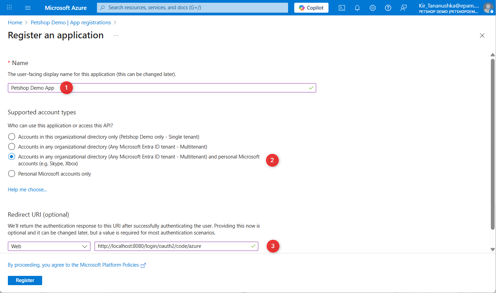

**Note on Cloud Deployment:**

When you deploy your application to the cloud, you'll need to update the redirect URI. After your application is
deployed to Azure App Service or Container Apps, you must add a new redirect URI in the format
`https://<your_app_name>.azurewebsites.net/login/oauth2/code/azure` to this application registration. You must also
change the protocol from `http` to `https`.

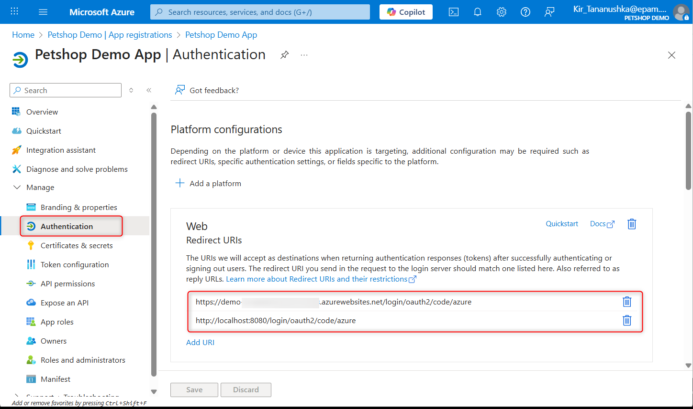

---

### Step 16: Get Your Application Unique Identifiers

Your application is now registered. The overview page for your new application contains all the essential information
you need. To connect your Spring Boot application to Microsoft Entra External ID, you need to get your unique
identifiers.

1. **Application (client) ID:** Look for the field labeled **Application (client) ID**. This is a unique identifier for
   your application. Copy this value; you'll need it for your Spring Boot application's configuration.
2. **Directory (tenant) ID:** Look for the field labeled **Directory (tenant) ID**. This is the unique ID for your new
   tenant. Copy this value as well.


---

### Step 17: Create and Add a Client Secret

Now you need to generate a secret key that your application will use to authenticate with Microsoft Entra External ID.

1. In the left-hand navigation menu, click **"Certificates & secrets"**.
2. Click the **"+ New client secret"** button A new panel will appear on the right side of the screen.
3. In the **Description** field, provide a meaningful description for your secret.
4. For **Expires**, choose the validity period for the secret. It's a best practice to choose the shortest timeframe for
   security.
5. Finally, click the **"Add"** button to create the secret.

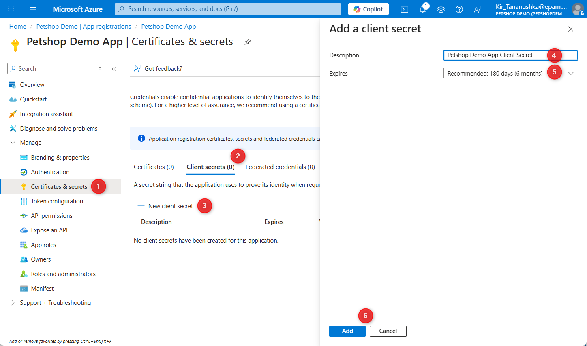

---

### Step 18: Get Your Client Secret Value

The most critical information on this page is the **Value** of the new client secret.

1. Find the row you just created for the `Client Secret`.
2. Look for the **Value** column. The string of characters you see there is your secret key.
3. **Immediately copy this value to a secure location.** You will not be able to see it again after you leave this page.

Now you have all three pieces of information needed to configure your Spring Boot application:

* The **Application (client) ID**
* The **Directory (tenant) ID**
* The **Client Secret**

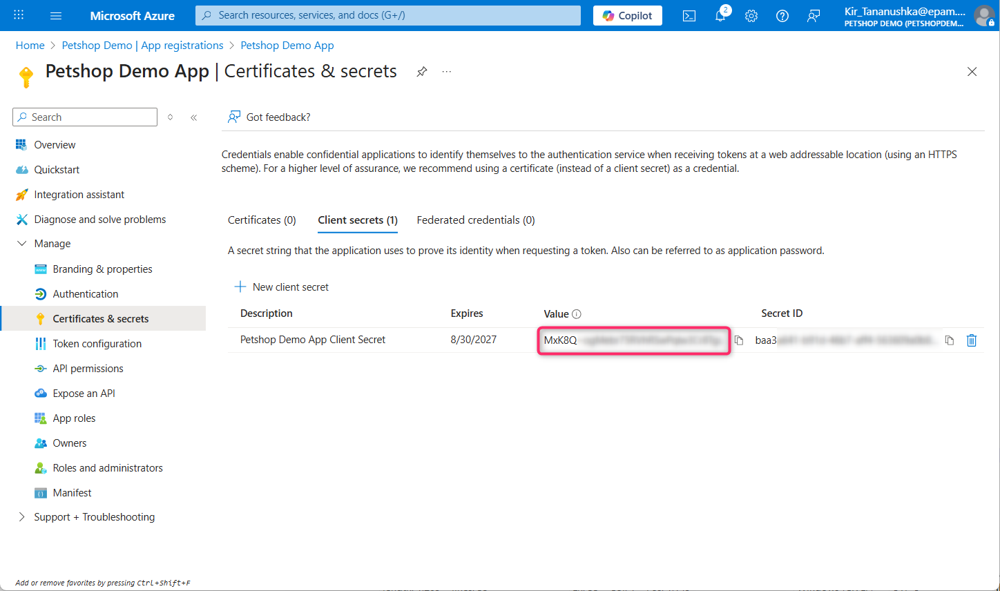

---

## 3. User Information Configuration

### Step 19: Configure Optional Claims for ID Tokens

To ensure your application receives additional user information in the ID token, you need to configure optional claims.

1. While still in your **Petshop Demo App** registration, in the left-hand navigation menu, click **"Token
   configuration"**.
2. Click the **"+ Add optional claim"** button.
3. Select **"ID"** as the token type (since your Spring Boot application uses ID tokens for authentication).
4. In the claims list, select the following claims:
    - **family_name** - Provides the last name, surname, or family name
    - **given_name** - Provides the first or "given" name of the user
    - **email** - The addressable email for this user (may not work in multi-tenant)
5. You will see a warning: **"Some of these claims (email, family_name, given_name) require OpenId Connect scopes to be
   configured through the API permissions page or by checking the box below."**
6. **Important**: Check the box **"Turn on the Microsoft Graph email, profile permission (required for claims to appear
   in token)"**.
7. Click **"Add"** to save the optional claims configuration.

**Note**: Email claims may not be returned in multi-tenant External ID applications due to Microsoft's security
restrictions. The given_name and family_name claims should work correctly for displaying user names.

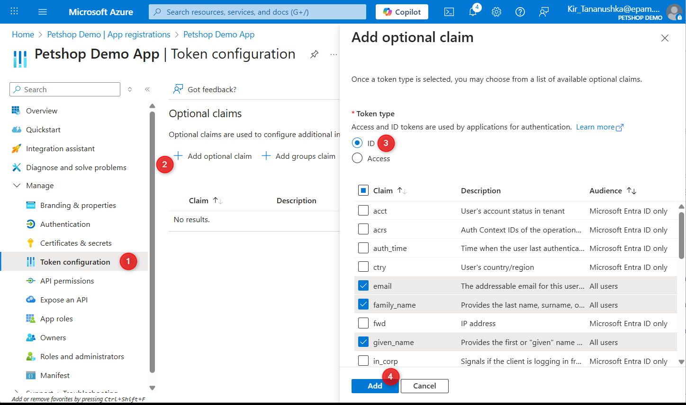

---

### Step 20: Verify API Permissions

After configuring optional claims, verify that the necessary API permissions are in place:

1. In the left-hand navigation menu, click **"API permissions"**.
2. You should see **Microsoft Graph** permissions including:
    - **email** - View users' email address
    - **profile** - View users' basic profile
    - **User.Read** - Sign in and read user profile
3. If these permissions show "Not granted for (tenant)", click **"Grant admin consent for (tenant name)"**.
4. Confirm the admin consent when prompted.

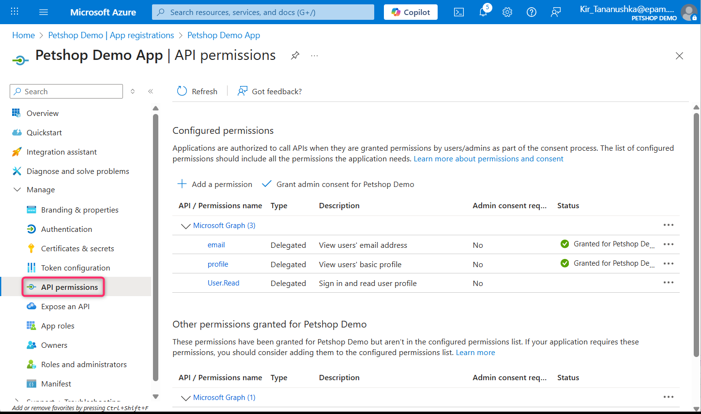

---

## 4. User Flow Setup

### Step 21: Navigate to Microsoft Entra External ID

1. In the search bar at the top of the portal, type **"Microsoft Entra ID"**.
2. From the search results, click on the service named **"Microsoft Entra ID"**. This will take you to the main overview
   page for the service.

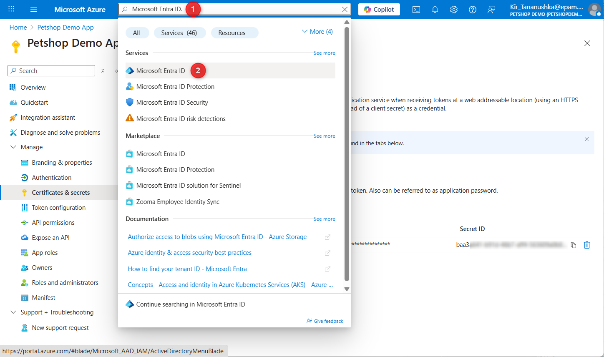

---

### Step 22: Navigate to External Identities

1. In the left-hand navigation menu, under the **Manage** section, click **External Identities**. This will take you to
   the section where you can manage user flows for your external customers.

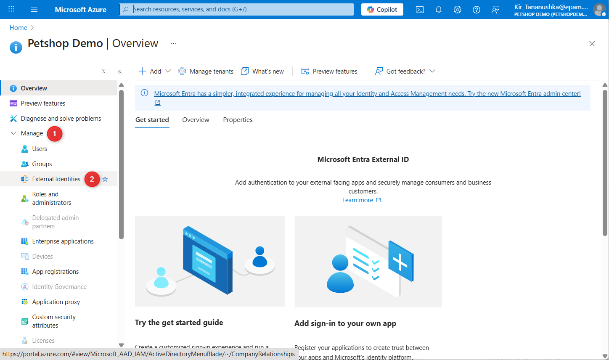

---

### Step 23: Create a New User Flow

1. In the left-hand navigation menu, under the **"Self-service sign up"** section, click on **"User flows"**.
2. Click the **"+ New user flow"** button in the top-left corner of the main content area. This will take you to the
   page where you can create and begin configuring a new flow.

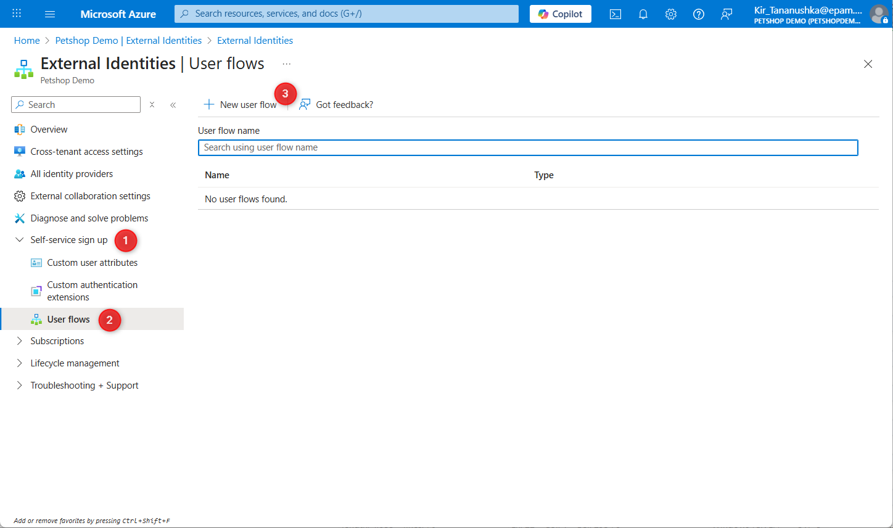

---

### Step 24: Configure the User Flow

1. **Name:** In the "Name" field, enter the exact name from your application's configuration: **signupsignin**. This is
   a critical step to ensure your application can correctly reference and use this flow.
2. **Identity providers:** For local testing and email-based logins, select **"Email Accounts"** and ensure **"Email
   with password"** is checked. This is a required authentication method for this type of flow.
3. **User attributes:** This is where you select the information your application will collect during user sign-up.
   Check the boxes next to the attributes you want to collect. For a typical application, **Given Name**, **Surname**,
   and **Display Name** are good choices to include.
4. Once you've filled in these fields, click the **"Create"** button at the bottom of the page.

After completing these steps, the "Sign up and sign in" user flow will be created. We can then proceed to the next stage
of configuration.

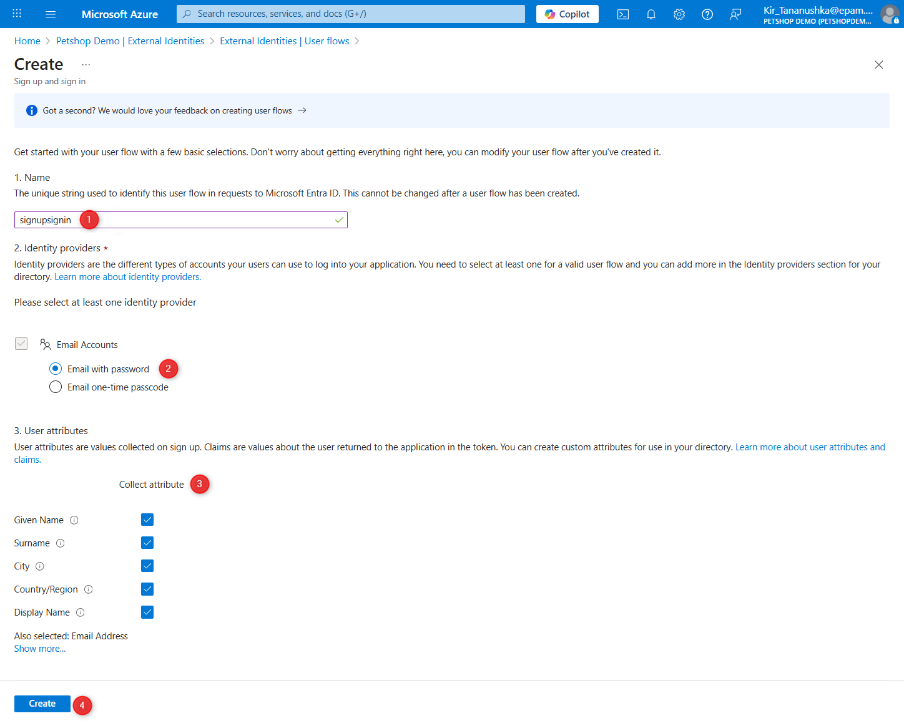

---

### Step 25: Finalize Your User Flow Configuration

To finish the setup and make sure your Spring Boot application can use this flow, you need to associate the application
with it.

1. Click on the **signupsignin** flow in the list.

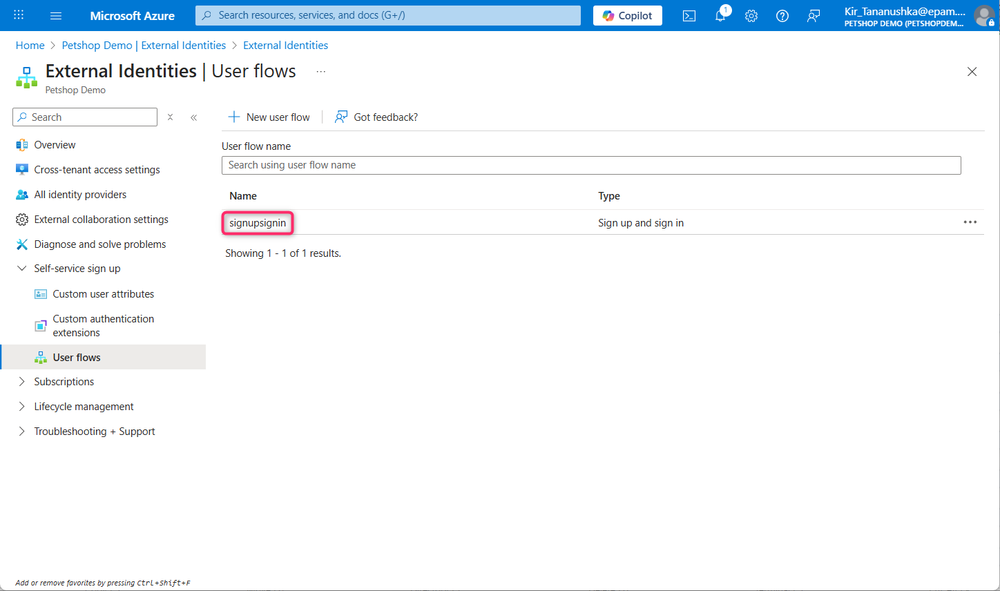

---

### Step 26: Associate Your Application

1. In the left-hand navigation menu, under the **"Use"** section, click on **"Applications"**.
2. Click the **"+ Add application"** button.

This will bring up a new panel where you can select your registered application to associate it with this user flow.

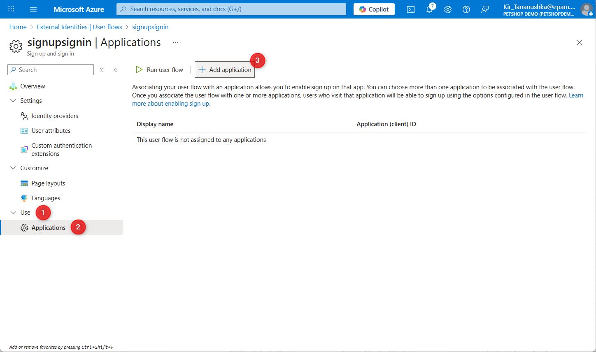

---

### Step 27: Link Your Application to the User Flow

1. In the list of applications, find and select **"Petshop Demo App"**.
2. Click the **"Select"** button at the bottom of the screen.

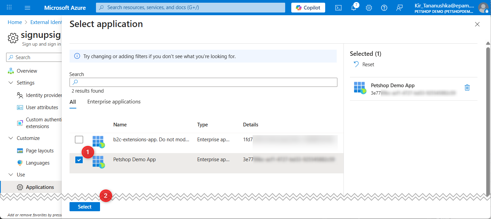

You should now see your application successfully linked to the user flow. This completes the configuration on the Azure
Portal side, and your Spring Boot application is ready to authenticate users using this flow.

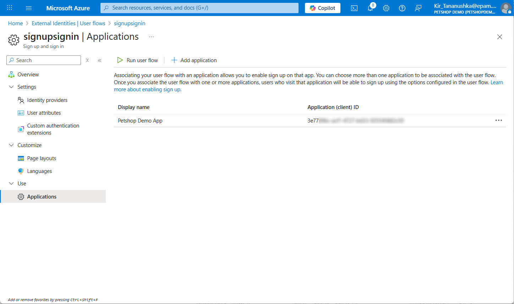

---

## 5. Additional Features

### Step 28: Navigate to Password Reset

1. While on the main **Microsoft Entra External ID** page (the one where you see the `Overview` and other sections in
   the left-hand menu), scroll down the left menu.
2. Under the **"Manage"** section, find and click on **"Password reset"**.

This will take you to the page where you can enable the password reset feature for all your users.

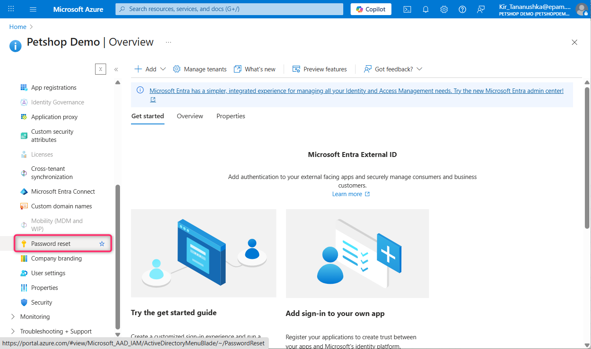

---

### Step 29: Enable Self-Service Password Reset (SSPR)

1. In the left-hand navigation menu, ensure that **Properties** is selected.
2. Under **Self service password reset enabled**, select **All** to enable the feature for all users in your tenant.
3. Click the **Save** button at the top of the page to apply your changes.

After completing this step, the self-service password reset feature will be enabled, allowing your customers to reset
their passwords without needing help from an administrator.

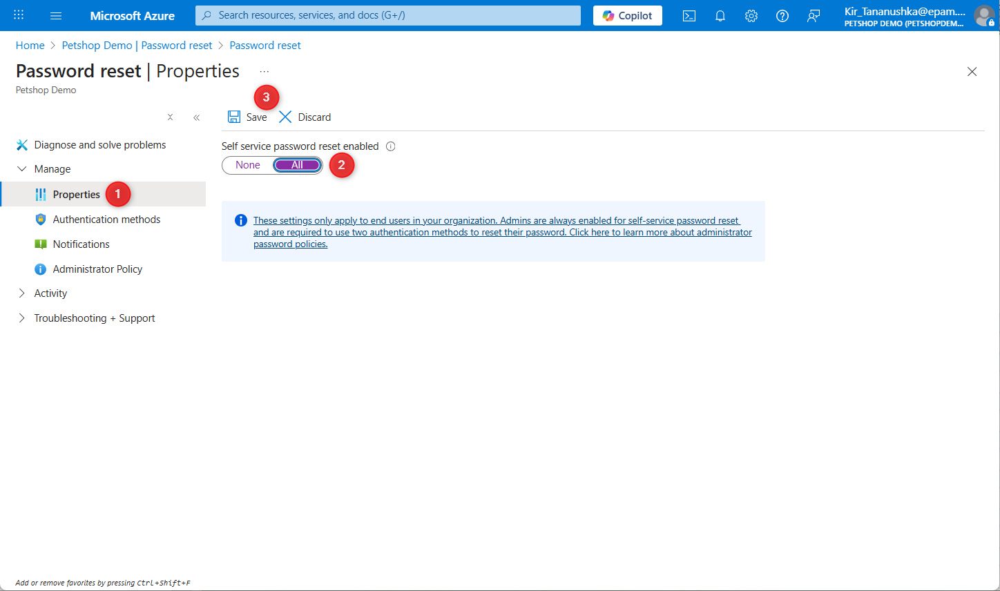

---

### Step 30: Get Your Tenant's Primary Domain

To find your tenant's primary domain, which is essential for your application's configuration, follow these steps:

1. Ensure you are on your **Petshop Demo** tenant's main page (you see the `Overview` in the left-hand menu).
2. Navigate to the **Overview** tab.
3. In the **Basic information** section, find the field labeled **Primary domain**.

The value in this field, such as `petshopdemo.onmicrosoft.com`, is the domain name you'll use to build the full base URI
for your application.

The full URI for your configuration will consist of:
`https://<your_domain>.ciamlogin.com/<your_domain>.onmicrosoft.com/`.

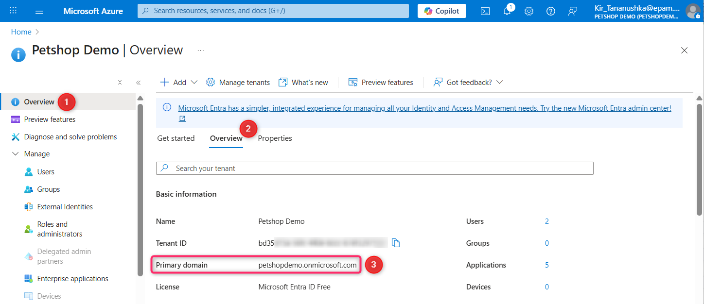

---

### Step 31: Try Accessing the Microsoft Entra Admin Center

After creating your tenant, you can manage it directly from the Microsoft Entra admin center. It's a specialized portal
for managing all identity and access services, designed to be a more focused and streamlined alternative to the broader
Azure Portal.

1. Navigate your browser to **https://entra.microsoft.com/**.
2. Log in with your administrator account for the `Petshop Demo` tenant.

This is the recommended place to perform tasks like user management, app registrations, and configuring user flows.

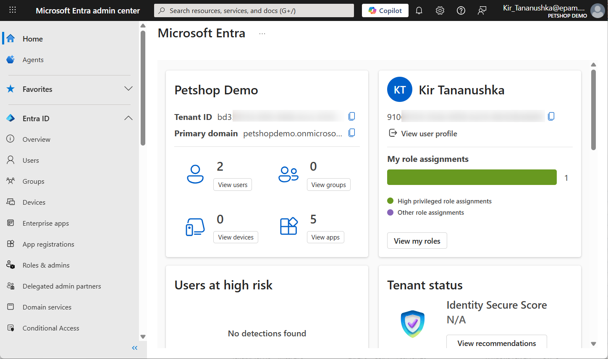

---

## 6. Application Setup

### Step 32: Test in IntelliJ IDEA First

First test your Spring Boot application directly in your IDE to ensure the configuration is working correctly.

#### Configure and Run in IntelliJ IDEA:

1. **Open your existing `RunApp8080` configuration** (`.run/RunApp8080.run.xml`)

2. **Verify the environment variables** are set correctly in the run configuration:
    - `AZURE_TENANT_DOMAIN=petshopdemo`
    - `AZURE_CLIENT_ID=your_client_id`
    - `AZURE_CLIENT_SECRET=your_client_secret`
    - `PETSTORE_SECURITY_ENABLED=true`

3. **Run the application** by selecting `RunApp8080` configuration and clicking Run

4. **Verify startup logs** show:
    - OAuth2 client registration loaded
    - Security configuration active
    - Application running on port 8080

5. **Test the application**:
    - Navigate to `http://localhost:8080`
    - Try to access protected pages to trigger authentication
    - Sign in with External ID and verify user data appears

**Note**: Replace the example values with your actual values from Steps 16 and 18.

---

### Step 33: Test with Docker Compose

After confirming the application works in IntelliJ, test the full containerized setup:

1. **Copy the environment template**:
   ```bash
   cp .env.sample .env
   ```

2. **Edit `.env` file** with your Azure External ID values:
   ```bash
   # Microsoft Entra External ID Configuration
   AZURE_TENANT_DOMAIN=petshopdemo
   AZURE_CLIENT_ID=your_client_id
   AZURE_CLIENT_SECRET=your_client_secret
   
   # Enable security for testing
   PETSTORE_SECURITY_ENABLED=true
   ```

3. **Start the full Pet Store stack**.
4. **Verify all services start correctly**.
5. **Test the complete application**.

---

### Step 34: Verify Authentication Flow

After both tests are successful:

1. **Test user sign-up**: Create a new account through External ID
2. **Test user sign-in**: Log in with existing credentials
3. **Verify user data**: Check that user information displays correctly
4. **Test logout**: Ensure complete logout from both application and External ID

---

## 7. Deployment to Azure

### Step 35: Prepare for Azure Deployment

Before deploying to Azure, you need to update the redirect URIs:

1. **Go to Azure Portal** → **App registrations** → **Your App**
2. **Click Authentication**
3. **Add production redirect URI**: `https://your-app-name.azurewebsites.net/login/oauth2/code/azure`
4. **Keep the localhost URI** for local development


---

### Step 36: Configure Application Settings

1. **Configure Application Settings** in Azure Portal:
    - `AZURE_TENANT_DOMAIN=petshopdemo`
    - `AZURE_CLIENT_ID=your_client_id`
    - `AZURE_CLIENT_SECRET=your_client_secret`
    - `PETSTORE_SECURITY_ENABLED=true`

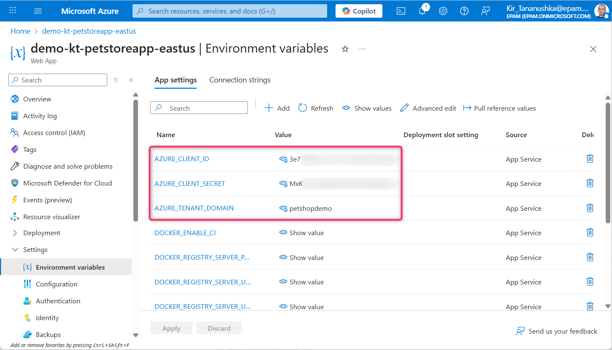

---

### Step 37: Deploy and Test

1. **Test the authentication flow** on the live URL
2. **Test user sign-up and sign-in** flows with your Pet Store application


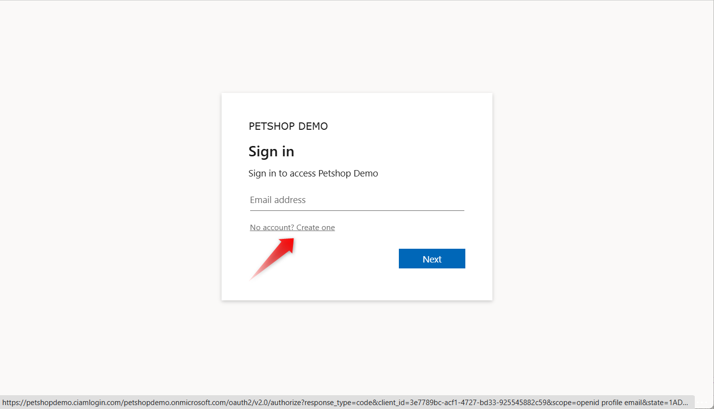

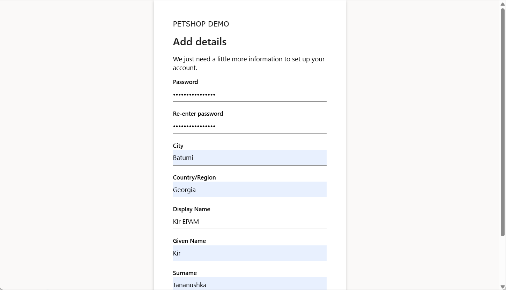

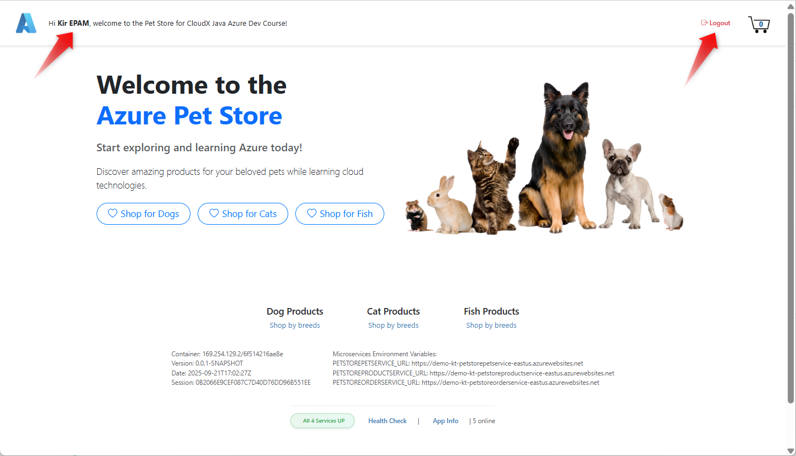

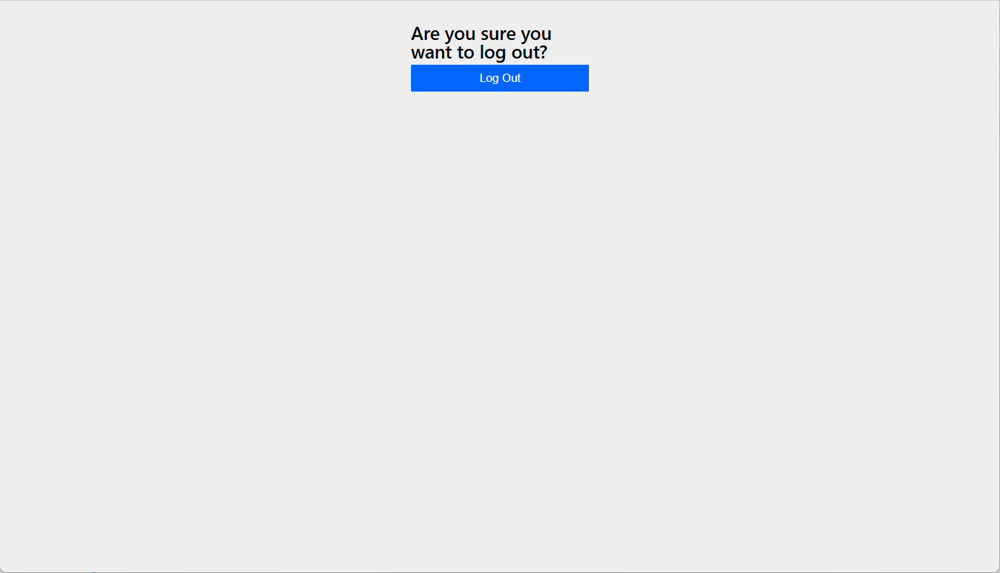