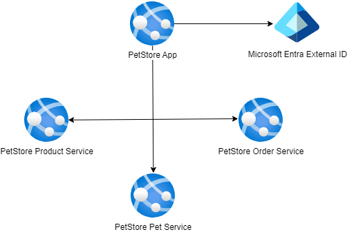

# Module 10: Authentication

## Task

The source code is available [here](../../../petstore).

> **NOTE:** For the deployment of services in this and all subsequent tasks, you may choose to use either **Azure App Services or Azure Container Apps** (the diagrams will depict App Services).

**Please complete the following task:**

1. Configure Microsoft Entra External ID as an identity provider.
2. Register the PetStore App as an External ID application.
3. Configure the unified user flow (handles both sign-up and sign-in) for the PetStore App within External ID.
4. Configure the PetStore App to use External ID authentication.
5. Ensure that users can successfully log in to the PetStore App using External ID authentication.
6. (Optional) Utilize Azure CLI to automate resource deployment.

**Useful links:**

- [Step-by-Step Guide](guides/step-by-step-guide/step-by-step-guide.md)

**Definition of Done:**

1. Microsoft Entra External ID has been configured as an identity provider.
2. PetStore App has been registered as an application in External ID.
3. The unified user flow has been configured for the PetStore App application.
4. PetStore App configuration has been updated to use External ID (OAuth2/OpenID Connect).
5. Localhost has not been used as the sole redirect URI.
6. Users can now log in to the PetStore App via External ID authentication.

**Consider providing the following screenshots as evidence of your task execution:**

- Screenshots displaying the configured Microsoft Entra External ID tenant in the Azure portal.
- Screenshots showing the registration of the PetStore App as an External ID application, including App Registrations,
  Authentication (with Redirect URIs), Certificates & Secrets, and other pages.
- Screenshots depicting the configured unified user flow (handles both sign-up and sign-in) for the PetStore App within
  External ID.
- Screenshots highlighting the PetStore App configuration to utilize External ID with OAuth2/OpenID Connect.
- Screenshots illustrating successful user logins to the PetStore App via External ID authentication.

  <ul>
    <li>When presenting the results of the practical tasks, please <a href="../common/presenting-results/presenting-results.md">follow these guidelines</a>.</li>
    <li><strong>When you have completed the task, attach the file(s) to the "Answer" field. Files should include a PDF/DOCX file with screenshots (optionally, you can also add a GIF/MP4 file). Please add a link to the updated Pet Store solution in a public Git repository to your PDF/DOCX file. Click "Submit."</strong></li>
    <li>Delete unnecessary resources.</li>
  </ul>

>**IMPORTANT:** Leaving resources running can result in additional costs. Either delete resources individually or remove the entire set of resources by deleting the resource group.
