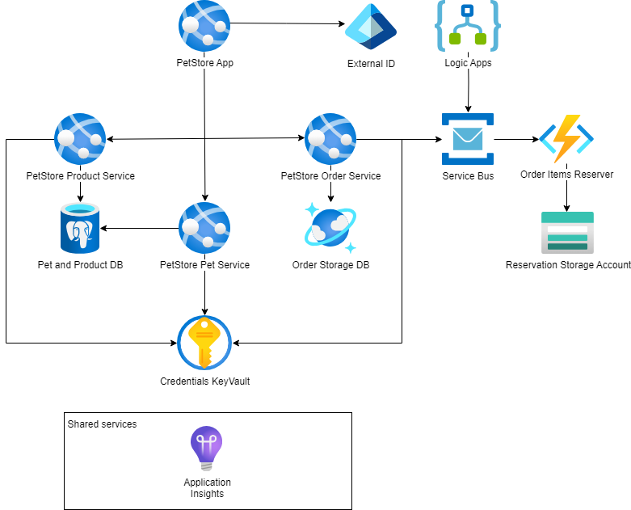

# Module 11: Final Assignment

## Task

The source code is available [here](../../../petstore).

Throughout the course, we gradually built the PetStore application step by step.
Now, for the final task, your goal is to bring all these individual pieces together into a single solution, following the diagram. Additionally, make sure to address the points mentioned below.

> **NOTE:** For the deployment of services in this task, you may choose to use either **Azure App Services or Azure Container Apps** (the diagrams will depict App Services).

**Please complete the following task:**

1. PetStore public API services should be available for auto-scaling.
2. *If using Azure App Services*: PetStore Web App should support deployment slots. *If using Azure Container Apps*:
   PetStore Web App should support multi-revision deployments.
3. Pet and Product Services should use Azure SQL as a database.
4. Order Service should use Cosmos DB as a database.
5. Order Items Reserver function should be able to create Reservation JSON files in Azure Blob Storage by communicating through Service Bus and handle errors by sending the email through Logic Apps.
6. PetStore Web App is protected by Microsoft Entra External ID for authentication.

**Definition of Done:**

1. The PetStore Public API services are configured for auto-scaling.
2. *If using Azure App Services*: Deployment slots are set up for the PetStore Web App. *If using Azure Container Apps*:
   Multi-revision deployments are configured for the PetStore Web App with traffic distribution.
3. The Pet and Product Services have successfully migrated to Azure Database for PostgreSQL.
4. The Order Service has been updated to use Cosmos DB as its database.
5. The Order Items Reserver Azure Function is able to create Reservation JSON files in Azure Blob Storage by communicating through the Service Bus.
6. Error handling is implemented to send emails through Logic Apps when issues with creating Reservation JSON files are encountered.
7. The PetStore Web App is secured with Microsoft Entra External ID for authentication.

**Consider providing the following screenshots as evidence of your task execution:**

- Screenshots showing the auto-scaling settings for PetStore Public API Services in the Azure portal.
- *If using Azure App Services*: Screenshots depicting the deployment slots set up for the PetStore Web App. *If using
  Azure Container Apps*: Screenshots showing multi-revision deployments and traffic distribution settings.
- Screenshots highlighting the connection between Azure Database for PostgreSQL and the Pet and Product Services.
- Screenshots illustrating CosmosDB's connection to the Order Service.
- Screenshots revealing the Order object within CosmosDB.
- Screenshots showcasing the configuration of the Order Items Reserver Azure Function.
- Screenshots detailing the Azure Service Bus configuration.
- Screenshots capturing the creation of Reservation JSON files in Azure Blob Storage.
- Screenshots documenting the error-handling implementation that sends emails through Logic Apps when issues arise.
- Screenshots demonstrating the External ID authentication mechanism.
- A screenshot showing the list of Azure resources that correspond to the diagram.

**Also, please provide a short video demo (5-10 minutes) covering a sample User Journey, such as:**

1.  Authentication (Security):
    - Open the PetStore Web App in Incognito/Private mode.
    - Click "Login" and authenticate via Microsoft Entra External ID (show the Microsoft sign-in screen).

2.  Order Placement (Core Flow & Messaging):
    - Select a category, add a product to the cart, and update the cart.
    - Navigate to Azure Portal -> Blob Storage and verify that a Reservation JSON file has been created. Open the file to demonstrate the correct Session ID and order details.

3.  Databases:
    - Show in Azure Portal (or via a database tool) that product/pet data is being retrieved from Azure SQL.
    - Show in Cosmos DB (Data Explorer) that a new Order record has been created.

4.  Infrastructure & Scaling:
    - Demonstrate the configuration of Deployment Slots (if using App Service) or Revisions (if using Container Apps).
    - Show the Auto-scaling settings for the Public API services.

5.  Error Handling (Logic Apps):
    - *Optional but recommended:* Simulate a failure (e.g., by temporarily breaking the Blob Storage connection string), show the message arriving in the Dead-Letter Queue (DLQ), and verify the Logic App sent an email.
    - *Alternative:* Show the Logic App workflow visualization in the portal and the history of successful runs.

**Check your peer's task**

1. Please review the Teams channel (Files tab) for information about the participant whose task you are assigned to assess.
2. Coordinate a meeting with your peer.
3. During this meeting, share your respective solutions with each other.
4. Evaluate how your peer completed the assignment by referring to the provided Definition of Done criteria.
5. Visit [learn.epam.com](http://learn.epam.com) - Contribution tab - Mentorship - Expert View.
6. Locate the CloudX Associate program and identify the participant whose task you have reviewed.
7. Provide a rating for the completed task.

  <ul>
    <li>When presenting the results of the practical tasks, please <a href="../common/presenting-results/presenting-results.md">follow these guidelines</a>.</li>
    <li><strong>When you have completed the task, attach the file(s) to the "Answer" field. Files should include a PDF/DOCX file with screenshots and your video demo (MP4). Please add a link to the updated Pet Store solution in a public Git repository to your PDF/DOCX file. Click "Submit."</strong></li>
    <li>Delete unnecessary resources.</li>
  </ul>

>**IMPORTANT:** Leaving resources running can result in additional costs. Either delete resources individually or remove the entire set of resources by deleting the resource group.
